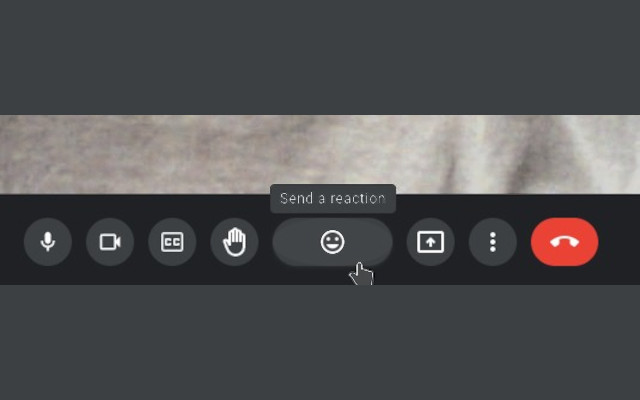

## Emoji Button Width for Google Meet

A Chrome Extension that increases the width of the emoji button in Google Meet 
to avoid accidental hand raises.



### Installation

#### Install via Chrome Web Store
This extension **should** be available from the CWS:
- https://chrome.google.com/webstore/detail/jfehmdbdjehkghjdlaclfebhgpmikhoi

#### Install by building from source
Clone this repo and run:
```shell
zip -r ~/publish.zip ./*
```

Once the file is zipped, you can drag and drop it onto the chrome://extensions 
page to install the extension.